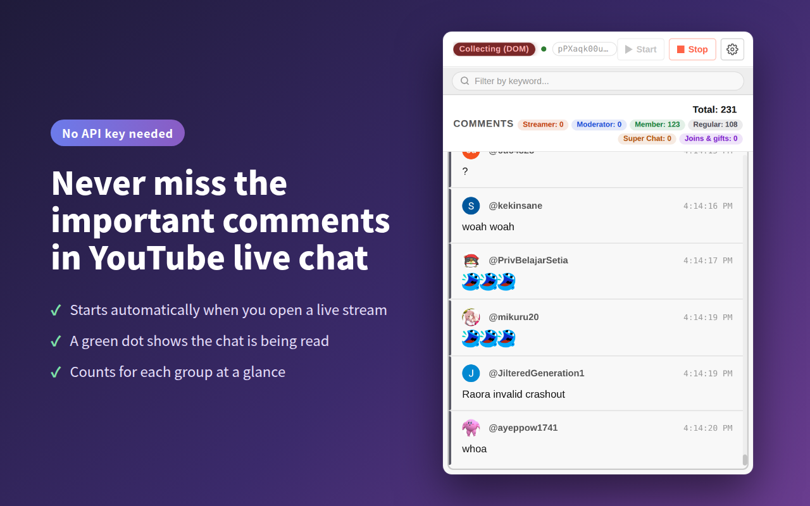
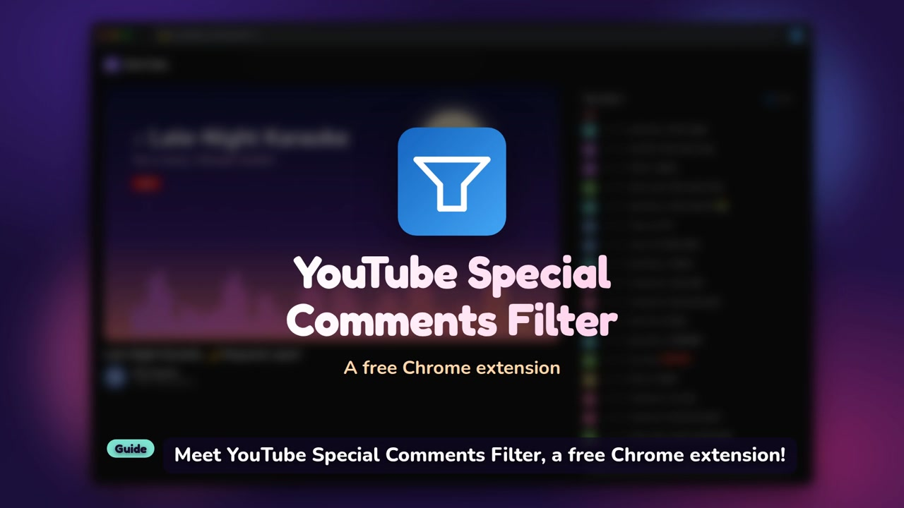

# YouTube Special Comments Filter

English | [日本語](README.md)

**Version:** v3.0.0 (the source of truth is `version` in [`src/manifest.json`](src/manifest.json).
Changes are listed in [`CHANGELOG.md`](CHANGELOG.md))

A Chrome extension that collects **streamer, moderator, member and regular** comments,
plus **Super Chats, Super Stickers and memberships**, from YouTube live chat,
and shows only the ones you want to see.



### Intro video (1 min)

[](https://youtu.be/7vWoDrHcUM4)

▶ [Watch on YouTube](https://youtu.be/7vWoDrHcUM4)

---

## Features

### Two sources

| Mode | How it works | API key |
|------|--------------|---------|
| **DOM mode** (default) | Reads the live chat on the YouTube page directly | Not needed |
| **API mode** | Fetches comments with the YouTube Data API v3 | Required |

### Two filter axes

Role (who sent it) and kind (what kind of message it is) are separate axes.
Super Chats can come from regular viewers too, so filtering by role alone would miss them.

| Axis | Toggles |
|---|---|
| Role | **Streamer** / **Moderator** / **Member** (sponsor) / **Regular** |
| Kind | **Super Chat** (including Super Stickers) / **Joins & gifts** (new members, milestones, gift purchases) |

**Everything is collected; the filters only change what is shown.**
Turn a toggle on later and the comments that came in before show up as well.

### Other features

- Keyword search across **everything** collected (with match count; invisible characters are ignored)
- Click a user name to show only that person's comments
  (in the YouTube chat itself, **Alt+click** a name or avatar to do the same)
- Count badges (total plus a breakdown by role and kind; the badges are toggles themselves)
- Super Sticker images (DOM mode only) and amount chips
- Avatars of the senders
- Dark mode (the popup and the settings page both follow it)
- Time format options (12/24-hour, with or without seconds)
- Auto start on live pages, auto scroll, debug mode
- Shows whether the chat is being read (while collecting in DOM mode)
- English and Japanese (follows the browser language; you can also choose one on the settings page)

---

## Installation

### From the Chrome Web Store (recommended)

Search for "YouTube Special Comments Filter" on the [Chrome Web Store](https://chromewebstore.google.com/) and install it.

### Manual install in developer mode

1. Clone this repository (or download and unzip it)
2. Open `chrome://extensions/` in Chrome
3. Turn on "Developer mode" in the top right
4. Click "Load unpacked"
5. Select the `src/` folder

---

## Usage

### DOM mode (no API key, default)

1. Open a YouTube live stream page
2. Click the extension icon in the toolbar
3. Collecting starts automatically (if it does not, click "Start")

To follow a single person, **Alt+click their name or avatar in the YouTube chat**
and the popup opens filtered to that person
(a plain click still opens YouTube's own menu with "Block" and "Report").

### API mode

1. Enable YouTube Data API v3 in [Google Cloud Console](https://console.cloud.google.com/) and create an API key
2. Enter and save the API key on the extension's settings (options) page
3. Open a YouTube live stream page
4. Click the toolbar icon and switch the source to **"API mode"**
5. Click "Start"

> **Note:** The free YouTube Data API v3 quota is 10,000 units per day. The API also limits how many comments a single request returns (details in [docs/api-limitations.md](docs/api-limitations.md), in Japanese).

### Display language

The popup and the settings page follow the browser language (English for any language other than Japanese).
To choose one yourself, open the settings page and pick **Automatic / English / 日本語** under "Language".
The extension name and the toolbar tooltip always follow the browser language (a Chrome limitation).

---

## Permissions

Only what is needed (reviewed in 2026-09).

| Permission | Used for |
|---|---|
| `storage` / `unlimitedStorage` | Settings, and the comment history of the last 5 streams (IndexedDB) |
| `scripting` | Injecting the script that reads the live chat |
| `alarms` | A once-a-minute watchdog that keeps collecting even after the service worker shuts down |
| `https://*.youtube.com/*` | Reading the live chat and telling whether a tab is a stream |
| `https://www.googleapis.com/youtube/v3/*` | The YouTube Data API v3, used only in API mode |

All comments are stored **only in your browser** and are never sent anywhere.

---

## Project structure

```
src/
├── manifest.json          # Chrome extension manifest (Manifest V3)
├── _locales/              # UI strings, the single source of truth (en / ja, Chrome's standard messages.json)
├── shared/                # Modules read from more than one context
│   ├── comment.js         # Comment type, normalization and IDs (the only place for them)
│   ├── store.js           # Comment history (IndexedDB; the only place for it)
│   ├── theme.js           # Applies the theme (read by the popup and the settings page)
│   └── i18n.js            # Looks up UI strings and handles the manual language choice (popup and settings page)
├── background/
│   └── service-worker.js  # Sessions, API calls, storage, watchdog (alarms)
├── content/
│   ├── content-script.js  # Watch page side (finds the stream and asks to start)
│   └── dom-chat.js        # Reads the live chat DOM
├── popup/                 # Popup (HTML/CSS/JS)
├── options/               # Settings page (HTML/CSS/JS)
└── icons/                 # Extension icons (16/32/48/128px)

test/                      # node:test tests (not shipped with the extension)
docs/                      # Design notes, plans and records (in Japanese)
```

---

## Tech stack

- **Languages:** HTML / CSS / JavaScript (vanilla)
- **Platform:** Chrome Extensions Manifest V3
- **External API:** YouTube Data API v3 (API mode only)
- **Storage:** IndexedDB (history) / `chrome.storage.local` (settings, session)
- **DOM watching:** MutationObserver

**There are no runtime dependencies.** The only development tool is ESLint.

---

## Development

There is no build step. Load the `src/` folder into Chrome as is.
To pick up changes, click the reload button (↺) on the extension's card in `chrome://extensions/`.

```bash
npm install   # first time only (the only dev tool is ESLint)
npm run lint
npm test      # node:test, about 430 tests, no dependencies
```

CI runs `npm ci` → `npm run lint` → `npm test` on every push and pull request
([`.github/workflows/ci.yml`](.github/workflows/ci.yml)).

The developer documentation ([`CLAUDE.md`](CLAUDE.md), [`docs/`](docs/)), the code comments and the commit messages are in Japanese.
UI strings live in `src/_locales/<lang>/messages.json`; when you add a key, add it to both `en` and `ja`
(`test/i18n.test.js` checks that the two match and that every key is used).

Keep this file and the Japanese [`README.md`](README.md) in sync
(`test/manifest.test.js` fails if the versions differ).
