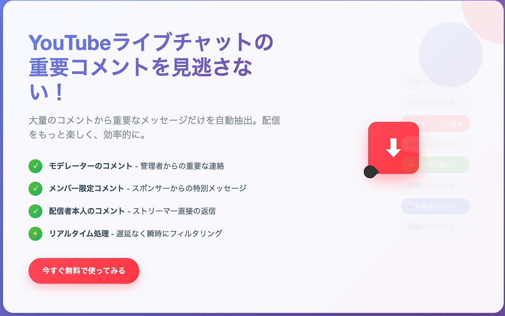

# YouTube特別コメントフィルター

**バージョン:** v1.5.1

YouTubeライブチャットで**モデレーター・メンバー（スポンサー）・配信者**からのコメントのみを抽出・表示するChrome拡張機能です。



---

## 機能

### 2つの動作モード

| モード | 説明 | APIキー |
|--------|------|---------|
| **API モード** | YouTube Data API v3 を使用してコメントを取得 | 必要 |
| **DOM モード** | YouTubeページのDOMを直接監視してコメントを取得 | 不要 |

### フィルター対象

- **配信者**（チャンネルオーナー）
- **モデレーター**
- **メンバー**（スポンサー）

### その他の機能

- ユーザー名クリックで個別フィルター
- キーワード検索（ヒット件数表示）
- コメント統計（合計・種別内訳）
- 自動スクロール
- デバッグモード
- ライブページでの自動起動オプション

---

## インストール方法

### Chrome ウェブストアから（推奨）

[Chrome ウェブストア](https://chromewebstore.google.com/) から「YouTube特別コメントフィルター」を検索してインストールしてください。

### 開発者モードで手動インストール

1. このリポジトリをクローン（またはZIPをダウンロード・解凍）
2. Chrome で `chrome://extensions/` を開く
3. 右上の「デベロッパーモード」をオンにする
4. 「パッケージ化されていない拡張機能を読み込む」をクリック
5. `src/` フォルダを選択する

---

## 使い方

### DOM モード（APIキー不要・簡単）

1. YouTubeのライブ配信ページを開く
2. ツールバーの拡張機能アイコンをクリック
3. モードを **「DOM」** に切り替える
4. 「取得開始」をクリック

### API モード

1. [Google Cloud Console](https://console.cloud.google.com/) で YouTube Data API v3 を有効化し、APIキーを取得
2. 拡張機能の設定ページ（オプション）でAPIキーを入力・保存
3. YouTubeのライブ配信ページを開く
4. ツールバーのアイコンをクリックし、モードを **「API」** に切り替える
5. 「取得開始」をクリック

> **注意:** YouTube Data API v3 の無料枠は1日あたり10,000クォータです。また、APIの仕様上1回のリクエストで取得できるコメント数に上限があります（詳細は [docs/api-limitations.md](docs/api-limitations.md) を参照）。

---

## プロジェクト構成

```
src/
├── manifest.json          # Chrome拡張機能マニフェスト (Manifest v3)
├── background/
│   └── service-worker.js  # バックグラウンドサービスワーカー（API通信・状態管理）
├── content/
│   ├── content-script.js  # メインコンテンツスクリプト（監視・メッセージ処理）
│   └── dom-chat.js        # DOMベースのチャット監視スクリプト
├── popup/
│   ├── popup.html         # ポップアップUI
│   ├── popup.js           # ポップアップコントローラー
│   └── popup.css          # ポップアップスタイル
├── options/
│   ├── options.html       # 設定ページ
│   ├── options.js         # 設定コントローラー
│   └── options.css        # 設定ページスタイル
└── icons/                 # 拡張機能アイコン (16/32/48/128px)

docs/
├── requirements.md        # 機能要件・設計仕様
└── api-limitations.md     # YouTube Data API v3 の制限事項調査
```

---

## 技術スタック

- **言語:** HTML / CSS / JavaScript (Vanilla)
- **プラットフォーム:** Chrome Extensions Manifest v3
- **外部API:** YouTube Data API v3
- **DOM監視:** MutationObserver

---

## 開発

現在はビルドツールを使用していません。`src/` フォルダを直接Chromeに読み込んで開発できます。

変更を反映するには、`chrome://extensions/` の拡張機能カードにある更新ボタン（↺）をクリックしてください。
