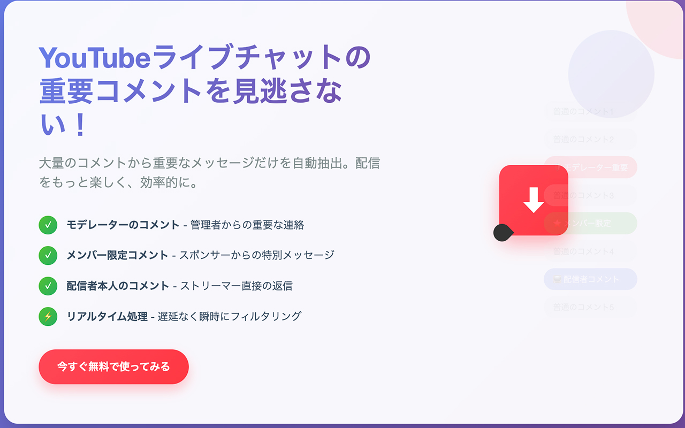

# YouTube特別コメントフィルター

**バージョン:** v2.0.0（正は [`src/manifest.json`](src/manifest.json) の `version`。
変更履歴は [`CHANGELOG.md`](CHANGELOG.md)）

YouTubeライブチャットから、**配信者・モデレーター・メンバー・一般**のコメントと
**スーパーチャット／スーパーステッカー／メンバーシップ**を取り込み、
見たいものだけを絞り込んで表示するChrome拡張機能です。



---

## 機能

### 2つの動作モード

| モード | 説明 | APIキー |
|--------|------|---------|
| **DOM モード**（既定） | YouTubeページのDOMを直接監視してコメントを取得 | 不要 |
| **API モード** | YouTube Data API v3 を使用してコメントを取得 | 必要 |

### フィルターの2軸

役割（誰の発言か）と種別（何のメッセージか）は別の軸です。
スーパーチャットは一般視聴者からも飛んでくるため、役割だけで絞ると取りこぼします。

| 軸 | トグル |
|---|---|
| 役割 | **配信者** / **モデレーター** / **メンバー**（スポンサー） / **一般** |
| 種別 | **スーパーチャット**（スーパーステッカーを含む） / **メンバーシップ**（新規加入・継続・ギフト購入） |

**取り込みは常に全件で、フィルターは表示側だけに掛かります。**
あとからトグルをONにすれば、それまでに流れた分もそのまま出てきます。

### その他の機能

- 取得済み**全件**に効くキーワード検索（ヒット件数表示・不可視文字を吸収）
- 発言者名クリックでその人だけに絞り込み
- 件数バッジ（合計と役割・種別ごとの内訳。バッジ自体がトグル）
- スーパーステッカーの画像表示（DOMモードのみ）と金額チップ
- 発言者のアバター表示
- ダークモード（popup / 設定画面とも追従）
- 時刻表示の切り替え（12/24時間・秒の有無）
- ライブページでの自動起動、自動スクロール、デバッグモード
- チャットを読み取れているかの表示（DOMモードで監視中のとき）

---

## インストール方法

### Chrome ウェブストアから（推奨）

[Chrome ウェブストア](https://chromewebstore.google.com/) から「YouTube特別コメントフィルター」を検索してインストールしてください。

### 開発者モードで手動インストール

1. このリポジトリをクローン（またはZIPをダウンロード・解凍）
2. Chrome で `chrome://extensions/` を開く
3. 右上の「デベロッパーモード」をオンにする
4. 「パッケージ化されていない拡張機能を読み込む」をクリック
5. `src/` フォルダを選択する

---

## 使い方

### DOM モード（APIキー不要・既定）

1. YouTubeのライブ配信ページを開く
2. ツールバーの拡張機能アイコンをクリック
3. 自動で取得が始まります（始まっていなければ「取得開始」をクリック）

### API モード

1. [Google Cloud Console](https://console.cloud.google.com/) で YouTube Data API v3 を有効化し、APIキーを取得
2. 拡張機能の設定ページ（オプション）でAPIキーを入力・保存
3. YouTubeのライブ配信ページを開く
4. ツールバーのアイコンをクリックし、モードを **「API」** に切り替える
5. 「取得開始」をクリック

> **注意:** YouTube Data API v3 の無料枠は1日あたり10,000クォータです。また、APIの仕様上1回のリクエストで取得できるコメント数に上限があります（詳細は [docs/api-limitations.md](docs/api-limitations.md) を参照）。

---

## 権限について

必要最小限だけを要求しています（2026-09 に見直し）。

| 権限 | 用途 |
|---|---|
| `storage` / `unlimitedStorage` | 設定と、直近5配信ぶんのコメント履歴（IndexedDB）の保存 |
| `scripting` | ライブチャットの監視スクリプトの注入 |
| `alarms` | Service Worker が終了しても取得を続けるための1分周期の見張り |
| `https://*.youtube.com/*` | ライブチャットの読み取りと、配信タブの判定 |
| `https://www.googleapis.com/youtube/v3/*` | APIモードのときだけ使う YouTube Data API v3 |

コメントは**すべて手元のブラウザの中だけ**に保存され、どこへも送信しません。

---

## プロジェクト構成

```
src/
├── manifest.json          # Chrome拡張機能マニフェスト (Manifest v3)
├── shared/                # 2つ以上の実行環境から読む共通モジュール
│   ├── comment.js         # コメントの型・正規化・ID（唯一の置き場）
│   ├── store.js           # コメント履歴の保存（IndexedDB。唯一の置き場）
│   └── theme.js           # テーマの適用（popup と設定画面が読む）
├── background/
│   └── service-worker.js  # セッション管理・API通信・保存・番人（alarms）
├── content/
│   ├── content-script.js  # watchページ側（配信の特定と開始要求）
│   └── dom-chat.js        # ライブチャットのDOM監視
├── popup/                 # ポップアップ画面（HTML/CSS/JS）
├── options/               # 設定画面（HTML/CSS/JS）
└── icons/                 # 拡張機能アイコン (16/32/48/128px)

test/                      # node:test のテスト（拡張機能には同梱されない）
docs/
├── audit-2026-09.md       # 全体監査（46件の欠陥）
├── redesign-plan.md       # 再設計計画（フェーズ0〜9）と実施記録
├── store-listing.md       # ストア掲載文の正
├── requirements.md        # 初期MVPの記録（歴史文書）
├── avatar-design.md       # アバター表示の設計
├── comment-display-design.md  # コメント表示の設計
├── super-sticker-image.md # ステッカー画像対応の事後分析
└── api-limitations.md     # YouTube Data API v3 の制限事項調査
```

---

## 技術スタック

- **言語:** HTML / CSS / JavaScript (Vanilla)
- **プラットフォーム:** Chrome Extensions Manifest v3
- **外部API:** YouTube Data API v3（APIモードのみ）
- **保存:** IndexedDB（履歴）/ `chrome.storage.local`（設定・セッション）
- **DOM監視:** MutationObserver

**実行時の依存パッケージはゼロです。** 開発ツールは ESLint だけ。

---

## 開発

ビルドは不要です。`src/` フォルダをそのままChromeに読み込んで開発できます。
変更を反映するには、`chrome://extensions/` の拡張機能カードにある更新ボタン（↺）をクリックしてください。

```bash
npm install   # 初回のみ（開発ツールは ESLint だけ）
npm run lint
npm test      # node:test。約280件・依存パッケージなし
```

`npm ci` → `npm run lint` → `npm test` は push と PR で CI が回します
（[`.github/workflows/ci.yml`](.github/workflows/ci.yml)）。

テストは「数時間使い込まないと発現せず、手動再現が困難」なバグに的を絞っています。
モックで検証できないもの（実ブラウザの挙動、YouTube側のDOM変更、見た目）は
[CLAUDE.md](CLAUDE.md) に明記してあります。

### 記載と実装の対応

この README で実装から乖離しやすい箇所と、その根拠コード
（この型は [`docs/store-listing.md`](docs/store-listing.md) に倣っています）。

| 記載 | 根拠 |
|---|---|
| DOMモードが既定 | `service-worker.js` の `getChatMode` が `result.chatMode \|\| 'dom'` を返す |
| 開くと自動で始まる | `autoStart` の既定は `true`。DOMモードは `content-script.js` の `tryDomModeAutoStart()` がAPIキー無しで開始する |
| 取り込みは全件 | 取り込み口が見るのは `shared/comment.js` の `isDisplayableKind()` だけで、表示フィルターは参照しない（再設計の決定1）。例外はギフトの**受領**告知で、量が多いため意図的に対象外 |
| 検索が取得済み全件に効く | popup は `primary` 枠をメモリに載せ、検索を始めた時点で `bulk` 枠を `shared/store.js` から読む（決定4） |
| 履歴は直近5配信ぶん | `shared/store.js` の `MAX_HISTORY_VIDEOS = 5`。1配信あたりの上限は保持枠ごとに `primary` 20,000 / `bulk` 50,000 |
| 6つのトグル | `shared/comment.js` の `DEFAULT_COMMENT_FILTERS`（`owner` / `moderator` / `sponsor` / `normal` / `superchat` / `membership`）と1対1で対応する |
| 権限は最小限 | `manifest.json` の `permissions` / `host_permissions`。内容は `test/manifest.test.js` が固定している |
| どこへも送信しない | 外部への通信は APIモードの `https://www.googleapis.com/youtube/v3/*` だけ（`service-worker.js` / `options.js`） |
